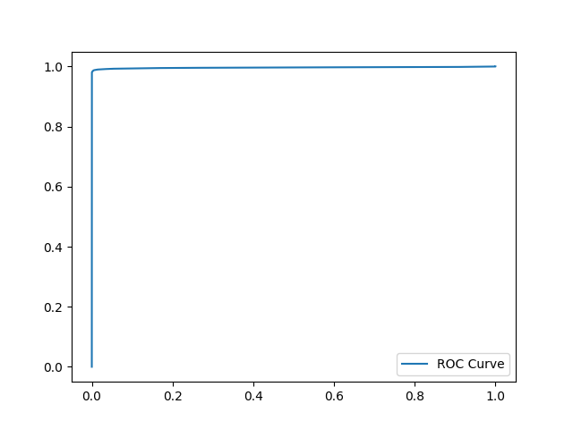

Please, organize files in this way:
```
./
├── data/
│	├── data_SM.txt
│	└── data_Class_Labels.txt
└── main.py
```
## main.py
        
Run main.py in a Python IDE or the terminal by typing ```python main.py```

## An example of output

main.py:
```
----------------------------------------
EER_threshold: 0.59
EER: 1.10%
----------------------------------------
FAR = 10%  ------> FRR value: 0.00%
FAR = 1%   ------> FRR value: 1.67%
FAR = 0.1% ------> FRR value: 97.33%
```

Genuine and impostor score distribution plot:
<p align="center"></p>

ROC curve:
<p align="center"></p>

The visualizations of FAR and FRR curve, and EER point:
<p align="center"></p>

##### This project was implemented for CmpE 58Z Sp.Tp. Introduction to Biometrics Course of Bogazici University.
